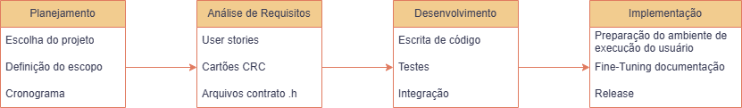
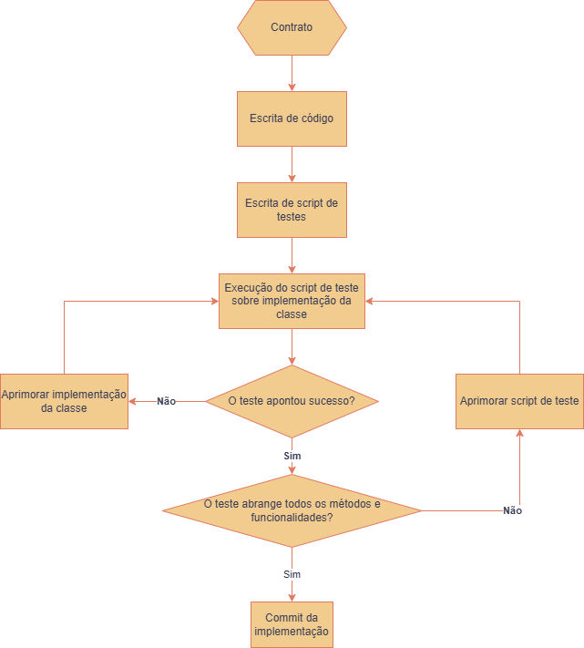

# Detalhamento do desenvolvimento do projeto

## Ciclo de desenvolvimento

O desenvolvimento do projeto seguiu, de forma geral, o seguinte fluxo:

Percebe-se que a seção de desenvolvimento engloba uma multitude de pontos. De fato, ela abrange o maior tempo despendido no percurso do projeto. Seu fluxo por si só foi efetuado conforme o seguinte fluxograma:

Note que para implementação de classes que dependam de interação entre outras classes, o script de testes deveria, também, verificar sua integração.

Durante o desenvolvimento, evitou-se ao máximo a modificação de arquivos de contrato. Contudo, devido à inexperiência dos integrantes da equipe, isso veio a acontecer em alguns momentos — em especial, nos momentos iniciais do desenvolvimento do projeto. Devido à ordem de implementação e desenvolvimento, contudo, estas mudanças não acarretaram em conflitos durante o processo.

## Atribuição de tarefas

A seguir segue a organização de tarefas para cada integrante do grupo. Note que algumas tarefas, como o desenvolvimento dos Cartões CRC, não estão inclusas. Isso se dá pois elas foram executadas por todos os elementos.

**Arthur Bertolini Moura:**

- Implementação de MapNode e Grafo
- Implementação MapGenerator
- Documentação
  
**Bernardo de Sousa Vieira:**
- Definição do contrato de PathFinder e Grafo
- Implementação de PathFinder e Map

**Heitor Augusto Oliveira Costa de Amorim:**
- Desenvolvimento de User Stories
- Implementação da seção de interação com usuário
